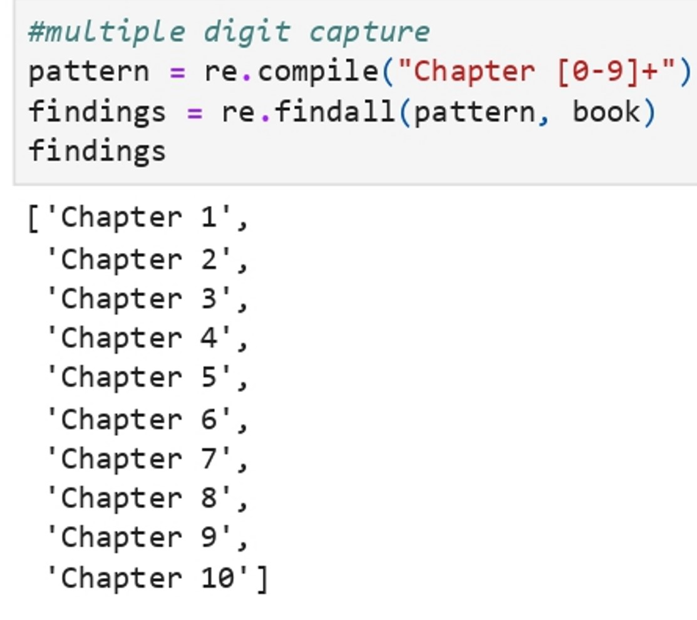
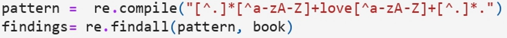
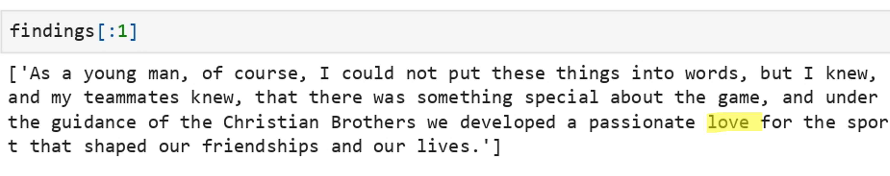
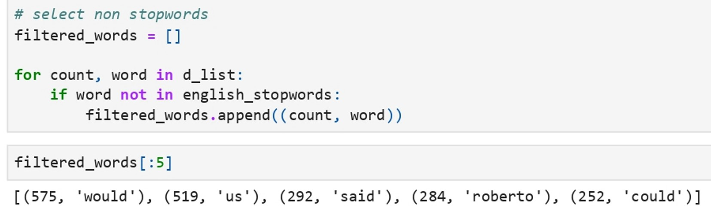
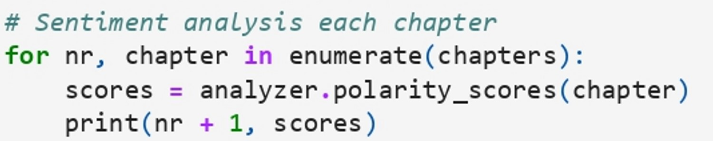
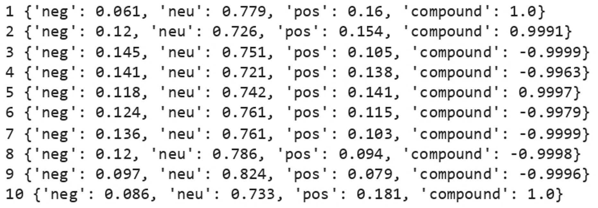

# Natural Language Processing of Books Using Python

## Project Description

**Overview :**  
The aim of this project is to leverage Natural Language Processing (NLP) techniques to analyze books programmatically using Python. The project focuses on extracting valuable insights from the text, including the identification of chapters, locating sentences with specific words, determining the most common words, and conducting sentiment analysis to evaluate the emotional tone of each chapter.

**Challenges :**  
Build The Natural Language Processing of Books Using Python.

## Project Goal

The project aims to analyze books programmatically using Python and extracting valuable insights.

## Tools & Library Used

 &nbsp;

## Project Result

[Click here to get full code](https://github.com/nickenshidqia/Natural_Language_Processing_of_Books_Using_Python/blob/917006136bcccfc08a256dbbcbaa768d7648a050/natural_language_processing.ipynb)

### Chapter Extraction:

Implement a script to automatically identify and extract chapters from the book.  

### Word Search:

Develop a functionality to locate sentences or paragraphs containing a specific word or phrase.  
Example :  
Which are the sentences where "love" was used?  
  

### Most Common Words :

Utilize NLP libraries to analyze the frequency of words in the book.  

### Sentiment Analysis:

Employ sentiment analysis tools to assess the emotional tone of each chapter.  
  

